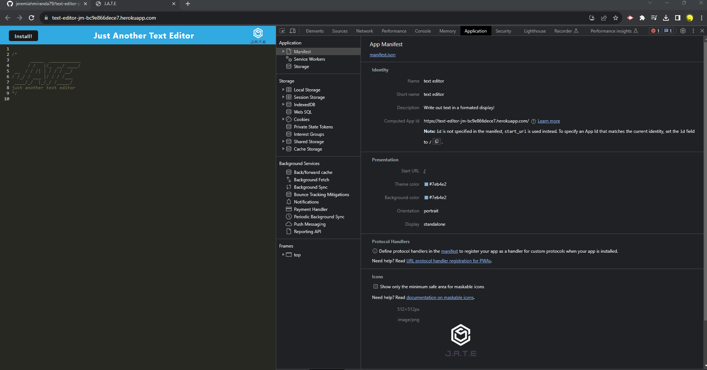
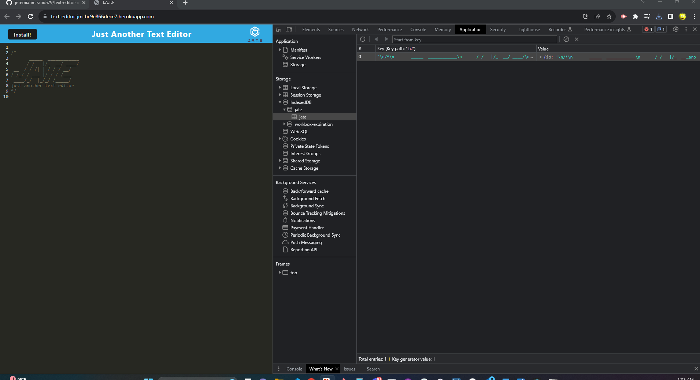
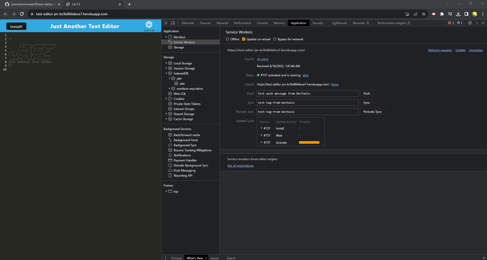

# text-editor-pwa
    
  ## License
   
 
  (https://www.gnu.org/licenses/gpl-3.0)

  ## Description
  - GIVEN a text editor web application
  - WHEN I open my application in my editor
  - THEN I should see a client server folder structure
  - WHEN I run `npm run start` from the root directory
  - THEN I find that my application should start up the backend and serve the client
  - WHEN I run the text editor application from my terminal
  - THEN I find that my JavaScript files have been bundled using webpack
  - WHEN I run my webpack plugins
  - THEN I find that I have a generated HTML file, service worker, and a manifest file
  - WHEN I use next-gen JavaScript in my application
  - THEN I find that the text editor still functions in the browser without errors
  - WHEN I open the text editor
  - THEN I find that IndexedDB has immediately created a database storage
  - WHEN I enter content and subsequently click off of the DOM window
  - THEN I find that the content in the text editor has been saved with IndexedDB
  - WHEN I reopen the text editor after closing it
  - THEN I find that the content in the text editor has been retrieved from our IndexedDB
  - WHEN I click on the Install button
  - THEN I download my web application as an icon on my desktop
  - WHEN I load my web application
  - THEN I should have a registered service worker using workbox
  - WHEN I register a service worker
  - THEN I should have my static assets pre cached upon loading along with subsequent pages and static assets
  - WHEN I deploy to Heroku
  - THEN I should have proper build scripts for a webpack application

  ## Table of Contents
  - [License](#license)
  - [Installation](#installation)
  - [Usage](#usage)
  - [Contribution](#contribution)
  - [Test](#test)
  - [Badges](#badges)
  - [Features](#features)

  ## Installation
  Clone: https://github.com/jeremiahmiranda79/text-editor-pwa

  ## Usage
  Test: https://text-editor-jm-bc9e866dece7.herokuapp.com/

  ## Contribution
  I used my README.md file generator to create this README.md 😉

  GitHub: https://github.com/jeremiahmiranda79/Pro-README-FILE-Generator

  Email: jeremiahmiranda79@gmail.com

  ## Test
  N/A

  ## Badges
          

  ## Features
  TODO: Manually add you features here(for now 😉)!
  - Manifest
  
  - Indexed
  
  - Service Worker
  